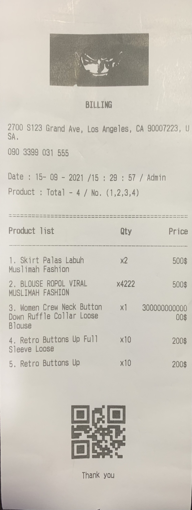
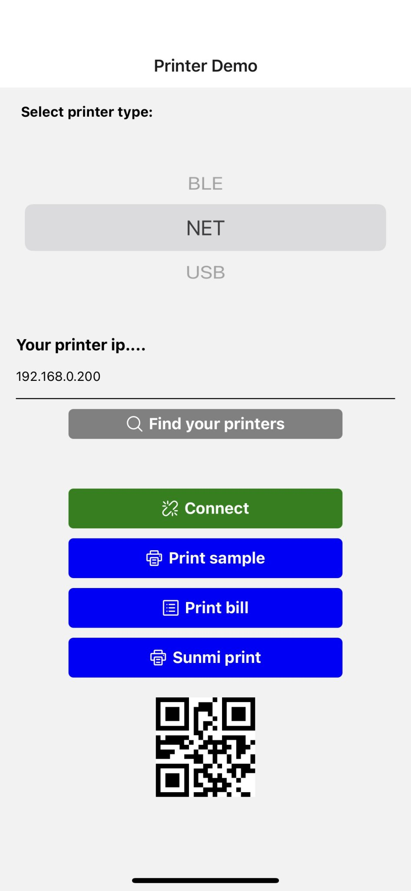

# react-native-thermal-receipt-printer-image-qr


- I fork this for my quickly project, this is not the official project.
- Fork of `react-native-thermal-receipt-printer` and add implement :
<br />

| Implement    | Android            | IOS                |
| ---------- | ------------------ | ------------------ |
| Image & QR | :heavy_check_mark: |   :exclamation: |
| Fix cut | :heavy_check_mark: | :heavy_check_mark: |
| Print With Column | :heavy_check_mark: | :heavy_check_mark: |
| NET Connect Timeout | :heavy_check_mark: | :heavy_check_mark: |

:grey_exclamation:**`Print Image & QR with bluetooth in IOS just implement not tested yet`**
<br /> <br />
<div style="display: flex; flex-direction: row; align-self: center; align-items: center">


</div>

## Installation

```sh
npm install react-native-thermal-receipt-printer-image-qr
```

## Setup for iOS

### 1. Install the IOS_SWIFT_WIFI_SDK Framework

1. Download the `IOS_SWIFT_WIFI_SDK.xcframework` from your provider
2. Place the framework in the `ios/Frameworks` directory of your project
3. The framework will be automatically linked through CocoaPods

### 2. Update your Podfile

Make sure your Podfile includes:

```ruby
pod 'react-native-thermal-receipt-printer-image-qr', :path => '../node_modules/react-native-thermal-receipt-printer-image-qr'
```

### 3. Install pods

```sh
cd ios
pod install
```

### 4. Update Info.plist

Add the following to your Info.plist:

```xml
<key>NSLocalNetworkUsageDescription</key>
<string>This app needs access to network to connect to the printer</string>
<key>NSBonjourServices</key>
<array>
    <string>_printer._tcp</string>
</array>
```

## Usage

```javascript
import { NetLabelPrinter } from 'react-native-thermal-receipt-printer-image-qr';

// Initialize the printer
await NetLabelPrinter.init();

// Connect to the printer
await NetLabelPrinter.connectPrinter('192.168.1.100', 9100);

// Setup printer parameters
await NetLabelPrinter.setup({
  width: 105,
  height: 80,
  speed: 4,
  density: 6,
  sensor: 0,
  sensorDistance: 3,
  sensorOffset: 3
});

// Print a barcode
await NetLabelPrinter.printBarcode({
  x: 30,
  y: 30,
  type: '128',
  height: 100,
  humanReadable: 1,
  rotation: 0,
  narrow: 2,
  wide: 2,
  content: 'barcode987654321'
});

// Print text
await NetLabelPrinter.printFont({
  x: 100,
  y: 180,
  fontName: '3',
  rotation: 0,
  xScale: 3,
  yScale: 3,
  content: '12345678 print test'
});

// Print QR code
await NetLabelPrinter.printQRCode({
  x: 50,
  y: 50,
  eccLevel: 'H',
  cellWidth: 4,
  rotation: 0,
  content: 'QRcode987654321'
});

// Print the label
await NetLabelPrinter.printLabel(1, 1);

// Close connection when done
await NetLabelPrinter.closeConn();
```

## Contributing

See the [contributing guide](CONTRIBUTING.md) to learn how to contribute to the repository and the development workflow.

## License

MIT

## API Reference
```tsx
    init: () => Promise;
    getDeviceList: () => Promise;
    /**
     * `timeout`
     * @default 4000ms
     */
    connectPrinter: (host: string, port: number, timeout?: number | undefined) => Promise;
    closeConn: () => Promise;
    /**
     * Print text
     */
    printText: (text: string, opts?: {}) => void;
    /**
     * Print text & end the bill & cut
     */
    printBill: (text: string, opts?: PrinterOptions) => void;
    /**
     * print with image url
     */
    printImage: (imgUrl: string, opts?: PrinterImageOptions) => void;
    /**
     * Base 64 string
     */
    printImageBase64: (Base64: string, opts?: PrinterImageOptions) => void;
    /**
     * Only android print with encoder
     */
    printRaw: (text: string) => void;
    /**
     * print column
     * 80mm => 46 character
     * 58mm => 30 character
     */
    printColumnsText: (texts: string[], columnWidth: number[], columnAlignment: ColumnAlignment[], columnStyle?: string[], opts?: PrinterOptions) => void;
```

## Styling
```js
import {
  COMMANDS
} from 'react-native-thermal-receipt-printer-image-qr';
```
[See more here](https://github.com/thiendangit/react-native-thermal-receipt-printer-image-qr/blob/main/dist/utils/printer-commands.js)

## Example
**`Print Columns Text`**
```tsx
const BOLD_ON = COMMANDS.TEXT_FORMAT.TXT_BOLD_ON;
const BOLD_OFF = COMMANDS.TEXT_FORMAT.TXT_BOLD_OFF;
let orderList = [
  ["1. Skirt Palas Labuh Muslimah Fashion", "x2", "500$"],
  ["2. BLOUSE ROPOL VIRAL MUSLIMAH FASHION", "x4222", "500$"],
  ["3. Women Crew Neck Button Down Ruffle Collar Loose Blouse", "x1", "30000000000000$"],
  ["4. Retro Buttons Up Full Sleeve Loose", "x10", "200$"],
  ["5. Retro Buttons Up", "x10", "200$"],
];
let columnAlignment = [ColumnAlignment.LEFT, ColumnAlignment.CENTER, ColumnAlignment.RIGHT];
let columnWidth = [46 - (7 + 12), 7, 12]
const header = ['Product list', 'Qty', 'Price']
Printer.printColumnsText(header, columnWidth, columnAlignment, [`${BOLD_ON}`, '', '']);
for (let i in orderList) {
  Printer.printColumnsText(orderList[i], columnWidth, columnAlignment, [`${BOLD_OFF}`, '', '']);
}
Printer.printBill(`${CENTER}Thank you\n`);
```
[See more here](https://github.com/thiendangit/react-native-thermal-receipt-printer-image-qr/blob/main/example/src/HomeScreen.tsx)

## Troubleshoot

- when install in `react-native` version >= 0.60, xcode show this error

```
duplicate symbols for architecture x86_64
```

that because the .a library uses [CocoaAsyncSocket](https://github.com/robbiehanson/CocoaAsyncSocket) library and Flipper uses it too

_Podfile_

```diff
...
  use_native_modules!

  # Enables Flipper.
  #
  # Note that if you have use_frameworks! enabled, Flipper will not work and
  # you should disable these next few lines.
  # add_flipper_pods!
  # post_install do |installer|
  #   flipper_post_install(installer)
  # end
...
```

and comment out code related to Flipper in `ios/AppDelegate.m`

## Support

| Printer    | Android            | IOS                |
| ---------- | ------------------ | ------------------ |
| USBPrinter | :heavy_check_mark: |                    |
| BLEPrinter | :heavy_check_mark: | :heavy_check_mark: |
| NetPrinter | :heavy_check_mark: | :heavy_check_mark: |

## Development workflow

To get started with the project, run `yarn bootstrap` in the root directory to install the required dependencies for each package:

```sh
yarn bootstrap
```

While developing, you can run the [example app](/example/) to test your changes.

To start the packager:

```sh
yarn example start
```

To run the example app on Android:

```sh
yarn example dev-android
```

To run the example app on iOS:

```sh
yarn example ios
```
